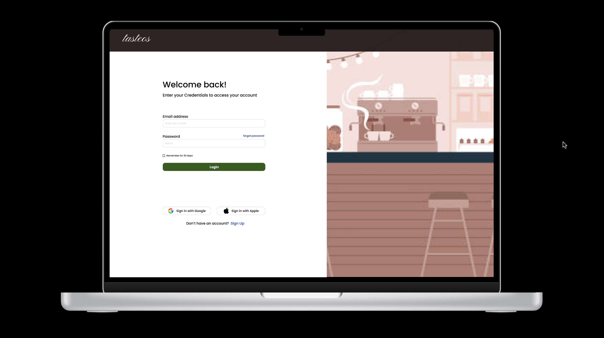

# WebApp Project by Group B - PROPOSAL

#### NAME AND MATRIC NUMBER OF GROUP MEMBERS:  
1. NUR EILYANA EIRDYNA BINTI ISMAIL (2222692)
2. IZZAH BINTI KAMARUL AZHAR (2310174)
3. FARAH NUR ATHIRAH BINTI SUKARDAN (2310960)  
4. NUR IRDINA BINTI ABD RAHMAN (2213414)
5. UMMU HANIE BINTI MOHD NOR (2313274) 

## TITLE OF THE PROJECT 

#### TasteOS – A Laravel-Based Shariah-Compliant Café Management System for Campus Entrepreneurs

## INTRODUCTION OF THE PROJECT

In merely a decade, youth-oriented cafe culture, primarily that of college students, has metamorphosed from casual social interaction into a statement of lifestyle, entrepreneurship, and community involvement. This change is even more evident in academic settings such as the International Islamic University Malaysia (IIUM), where cafes basically serve as meeting points for students and entrepreneurs. Nevertheless, many of these cafe enterprises are still plagued with the very common problems of manual order processing, irregular inventory control, and a lack of service area integration.

This project seeks to tackle the discovered inefficiencies by creating a cafe management system based on Laravel technology, provisionally referred to as **TasteOS**. The proposed solution will help student entrepreneurs, startup cafe owners, and campus vendors improve backend processes and customer service using the Model-View-Controller (MVC) architecture that Laravel is based on.

#### The system will provide:
- A centralized online platform to manage menus and process orders.
- Basic inventory management to track ingredients to ensure items are not understocked or overstocked.
- A role-based authentication system for various types of employees and café owners.
- A user interaction module that tracks simple input from customers.

#### The goal of this project by our team is to assist by:
- Using effective and safe digital technologies to modernize small & medium-sized cafes.
- Encouraging university students to engage in business activities in an Islamic context.
- Providing a management tool that is easy to use and abides by moral and corporate regulations.

This Laravel web application will try to close a technical gap that is often overlooked by providing a functional, relevant, and contextual response that represents the real-life operating conditions that IIUM students and other young cafe owners will encounter.

## OBJECTIVES OF THE PROJECT 

This project aims to provide a meaningful and ethical digital solution to the evolving cafe market, particularly for those initiated or managed by student entrepreneurs within university environments such as IIUM. This Laravel application is designed to improve business management while supporting the personal and professional development of young operators to lead the way in the marketplace and respond to the need for systems that are efficient, secure, and compliant with Shariah.

#### The main objectives are:
- To design and build a modular web-based application to effectively manage the operations of a cafe utilizing the Model-View-Controller (MVC) architectural design pattern in Laravel. This includes processing ingredients to make ordered drinks, inventory management, the ability to change menu items, and easy customer-facing interactions.
  
- To motivate undergraduate students to pursue responsible digital entrepreneurship by integrating role-based access control, structured processes, and ethical business conduct into an accessible and educational system framework.

- To provide a platform that is scalable and contextualized to assist small to medium-sized cafe enterprises—particularly campus-based ones—enabling them to upgrade using a solution that maintains Islamic values and improves quality of service and sustainability in the long run.

## FEATURES AND FUNCTIONALITIES OF THE PROJECT
#### 1. Menu Management (Admin Module)
- Add/Delete/Edit menu items (CRUD)
- Categorize items (e.g: drinks, desserts)
- Upload images, prices and descriptions
- Set item availability (in-stock/out of stock)

#### 2. Point of Sale (POS) System (Staff Module)
- New order creation: select items, quantity, table service/takeaway
- Auto price calculation
- Reak-time order status: Payment Pending, Preparing, Completed
- Print receipt

#### 3. Order Queue Management
- Display active orders by time/status
- Live update of kitchen queue
- Filter by table, type (dine-in/takeaway) or staff

#### 4. Inventory Management (Admin Module)
- Add/Delete/Edit ingredients (CRUD)
- Track stock levels
- Set low stock alerts or restock reminders

#### 5. Customer & Loyalty System
- Register customers
- Track order history per customer
- Award loyalty points per order
- View and redeem awards

#### 6. Reporting & Analytics
- Daily/weekly/monthly sales reports
- Best-selling items and slow movers

## ERD DIAGRAM FOR OUR SYSTEM

This ERD represents a restaurant management system with five main modules: Menu Management, POS (Point of Sale), Inventory Management, Customer Loyalty, and Sales & Reports. The system includes entities such as MenuItem for managing food and drinks, Order and OrderItem for handling customer orders and calculating totals, InventoryItem for tracking stock levels, Customer and LoyaltyPoint for managing customer details and reward points. Relationships connect inventory to menu, customers to orders, orders to ordered items, and menu items to order items, enabling efficient operations, real-time inventory control, and customer engagement tracking.

 

## SEQUENCE DIAGRAM 

#### 1. Menu Management (Admin Module)

#### 2. Point of Sale (POS) System (Staff Module) and Order Queue Management

#### 3. Inventory Management (Admin Module)

#### 4. Customer & Loyalty System

#### 5. Reporting & Analytics

## PROTOTYPE

 

## REFERENCES

1. Yadav, N., Rajpoot, D. S., & Dhakad, S. K. (2019, November). LARAVEL: a PHP framework for e-commerce website. In 2019 Fifth International Conference on Image Information Processing (ICIIP) (pp. 503-508). IEEE.
2. Santoso, G. B., Sinaga, T. M., & Zuhdi, A. (2021). MVC Implementation In Laravel Framework For Development Web-Based E-Commerce Applications. Intelmatics, 1(1).
3. Lestari, T. (2020). Implementing Laravel Framework for E-Commerce: Case Study at Indonesian Farmer Shop Center. International Journal of Advanced Science Computing and Engineering, 2(1), 14-20.
   

